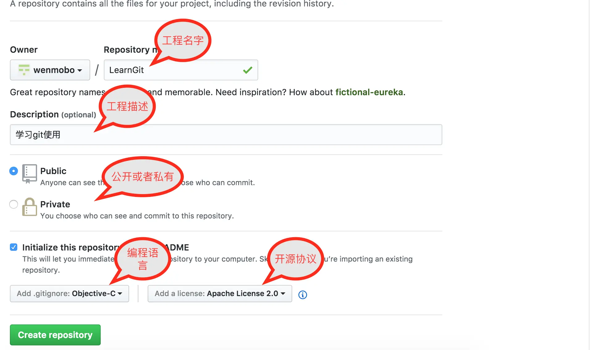

# MAC上Git安装与GitHub基本使用

## 目录

1. 安装git  
2. 创建ssh key、配置git
3. 提交本地项目到GitHub

### 一、安装git

#### 通过homebrew安装Git

1. 未安装homebrew，需安装homebrew

```
/usr/bin/ruby -e "$(curl -fsSL https://raw.githubusercontent.com/Homebrew/install/master/install)"
```

2. 安装git

```
brew install git
```

### 二、创建ssh key、配置git

1. 设置username和email（github每次commit都会记录他们）

   ```js
   git config --global user.name "Arvin"
   git config --global user.email "qiugavin@126.com"
   ```

2. 通过终端命令创建ssh key

   ```js
   ssh-keygen -t rsa -C "qiugavin@126.com"
   ```

   回车会有要求确认路径和输入密码，我们这使用默认的一路回车就行。成功的话会在**~/**下生成.ssh文件夹，进去，打开id_rsa.pub，复制里面的key。  

   终端查看`.ssh/id_rsa.pub`文件

   ```
   open .ssh/id_rsa.pub 
   ```

   回车后，就会新弹出一个终端，然后复制里面的key。
   或者用cat命令查看

   ```
   cat .ssh/id_rsa.pub
   ```

3.  登录GitHub（默认你已经注册了GitHub账号），添加ssh key，点击**Settings**，如图

点击New SSH key，如图

添加key，如图


4. 链接验证
   ```
   ssh -T git@github.com
   ```
   终端输出结果
   ```
    Last login: Sat Jan  6 14:42:55 on ttys000
    WMBdeMacBook-Pro:~ WENBO$ ssh -T git@github.com 
    Hi wenmobo! You've successfully authenticated, but GitHub does not provide shell access.
    WMBdeMacBook-Pro:~ WENBO$ 
   ```
   说明已经链接成功。

### 三 、提交本地项目到GitHub

1.  在GitHub上新创建一个 repository或者Start a Project，如图：
   

2. 填写项目信息，如下图所示：
   
   点击Create repository,就创好一个工程了。

3. Clone工程到本地，首先复制 ssh 地址
   

   打开终端，这里只是测试，我想把工程克隆在桌面，首先在终端中切换路径到桌面，输入以下命令：

   ```
   cd /Users/WENBO/Desktop/
   ```
   然后克隆项目,终端输入
   ```
   git clone git@github.com:wenmobo/LearnGit.git
   ```

4. 提交上传
   ```
    //文件添加到仓库（.代表提交所有文件）
    git add .
    //把文件提交到仓库
    git commit -m "First Commit"
    //上传到github
    git push
   ```